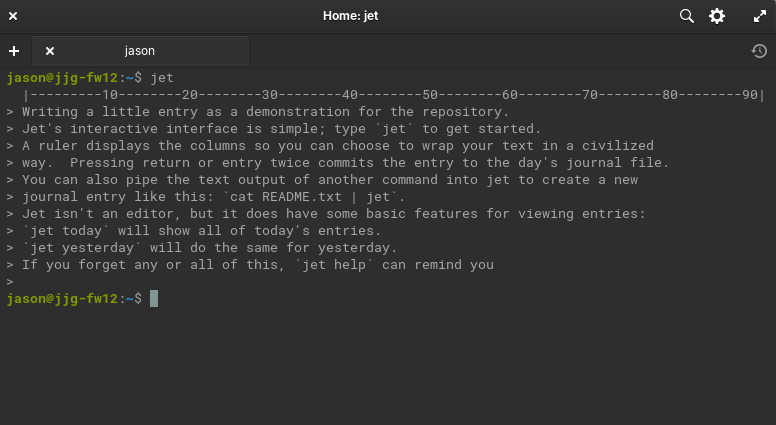

# jet
Journal EnTry

A reliable focused writing tool.

## Status
Jet is close to complete.  This project is evolving into something a bit broader than just Jet, so expect to see more changes soon.

## Installation
Download the `jet` binary from the [bin](bin) directory for your architecture/os and put it somewhere in your path.

Alternatively (if you have Go installed), install it with `go install ./cmd/jet/`.`

## Usage
1. Open a terminal and type `jet`
2. Type your journal entry
3. When you're done, press return on a blank line

`jet` will create a directory called `jet-journal` in your home directory where it will keep a new journal file for each day containing the entries you record as shown above.  Feel free to edit and consume these files however you like, `jet` will simply append to the current day's file if a new entry is recorded for that day.

### Subcommands

* `jet help`: displays some info and instructions
* `jet today`: displays the contents of the current day's journal entries
* `jet yesterday`: displays the contents of yesterday's entries

## TODO
Some potential ideas for the future.

- [X] `today` subcommand
- [X] `yesterday` subcommand
- [ ] `tomorrow` subcommand
- [ ] `week` subcommand
- [X] `help` subcommand
- [ ] `find` subcommand
- [X] Add linefeeds between entries
- [ ] Provide better errors (don't just `panic()` all the time)
- [ ] Allow journal dir to be customized?
- [X] Allow text to be piped-in?
- [X] Add a build script so binaries can be built in one step
- [ ] Add date to header of each journal file?
- [X] Tweak journal file permissions (only accessible to owner by default)
- [ ] Arbitrary date subcommand?
- [ ] Jet for lists?
